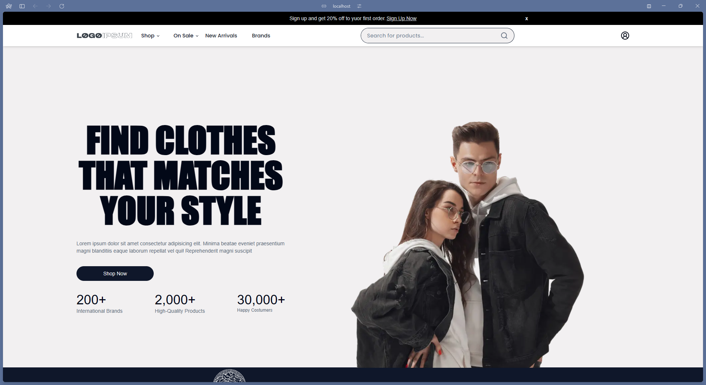

# [E-commerce Project]


## 🌟 Overview
This project is a learning-focused replica of an e-commerce clothing store template built by [Hamza Naeem](https://www.figma.com/community/file/1273571982885059508/e-commerce-website-template-freebie), featuring user profile management and sign-in/sign-up functionality. It was designed to help me practice building dynamic and user-friendly web applications.

This project was developed as a self-educational initiative to enhance my skills in NextJS, Drizzle-ORM and Jest.
---

## 🚀 Features
- ⚙ Profile Management.
- 📟 Sign-in/Sign-up functionality.
- 🆔 Sing-in with an Google account
---

## 📸 Screenshots/Demo
Showcase what the project looks like or how it works with images, GIFs, or links to a live demo.

**Example**:


[Live Demo](https://your-project-demo-link.com)

---

## 🛠️ Technologies Used:
- **Frontend**: React, TypeScript, NextJS,
- **Backend**: Node.js, Drizzle, Next-auth
- **Database**: MongoDB

---

## 📦 Installation
Provide clear and easy-to-follow steps to set up the project locally.

```bash
# Clone the repository
git clone https://github.com/your-username/your-repo-name.git

# Navigate to the project directory
cd your-repo-name

# Install dependencies
npm install

# Start the docker 
docker compose up 

# Start the development server
npm run dev
